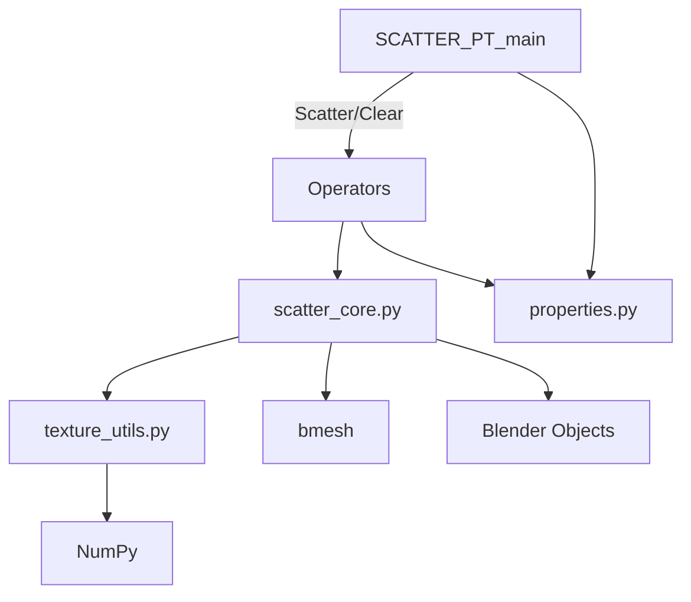

# Parametric Scatter — Blender Add-on

**Вариант 46:** 3D-редактор для параметрического размещения объектов.


Модуль-расширение для Blender, реализующий параметрическое размещение геометрических объектов в заданном пространстве (аналог Corona Scatter). Управление плотностью, масштабом и поворотом на основе карт текстур.

---

## Возможности

- Параметрическое рассеивание объекта-источника по поверхности целевого mesh
- **3 карты текстур**: Density (плотность), Scale (масштаб), Rotation (поворот)
- Выравнивание экземпляров по нормалям поверхности
- Группировка в коллекции для производительности
- Seed для воспроизводимости результата
- Полная поддержка Undo/Redo
- Интеграция в боковую панель 3D Viewport

## Быстрый старт

```bash
# Установка зависимостей для разработки
pip install -r requirements-dev.txt

# Запуск тестов
python -m pytest tests/ -v --cov=blender_scatter_addon

# Проверка безопасности
bandit -r blender_scatter_addon/
```

## Установка аддона

1. Скопируйте папку `blender_scatter_addon` в:
   - **Blender 4.2+**: `%APPDATA%/Blender Foundation/Blender/5.1/extensions/user_default/`
   - **Blender 4.0-**: `%APPDATA%/Blender Foundation/Blender/5.1/scripts/addons/`
2. В Blender: `Edit → Preferences → Add-ons`
3. Найдите "Parametric Scatter" и активируйте

## Использование

```
View3D → Sidebar (N) → Scatter
```

1. **Source** — объект для рассеивания
2. **Surface** — поверхность-цель
3. **Texture Maps** (опционально):
   - Density — карта плотности
   - Scale — карта масштаба
   - Rotation — карта поворота
4. **Parameters**: Count, Scale Min/Max, Seed
5. **Scatter** — запуск

## Архитектура



## Docker

```bash
# Сборка образа
docker-compose build

# Запуск тестов в Docker
docker-compose run pytest

# Проверка безопасности
docker-compose run security

# Интеграционный тест Blender в Docker
docker-compose run blender-test
```

## Тестирование

| Уровень | Инструмент | Описание |
|---------|-----------|----------|
| Модульное | pytest | 9 тестов для texture_utils |
| Интеграционное | Blender --background | Scatter/Clear в Blender |
| Безопасность | bandit | SAST-анализ Python-кода |
| Зависимости | safety | Проверка уязвимостей пакетов |
| Lint | flake8 | Статический анализ кода |

## API

### `scatter_core.scatter_objects(settings) -> bool`

Запускает рассеивание. Принимает `ScatterSettings` PropertyGroup.

### `scatter_core.clear_scatter(source_name: str)`

Удаляет все рассеянные экземпляры по имени коллекции.

### `texture_utils.load_texture_as_grayscale(image) -> np.ndarray | None`

Конвертирует Blender Image в grayscale numpy-массив.

### `texture_utils.sample_texture(tex, u, v) -> float`

Сэмплинг текстуры по UV-координатам (wrap-режим).

## Git flow

| Ветка | Назначение |
|-------|-----------|
| `main` | Стабильная версия |
| `develop` | Разработка |
| `feature/*` | Новые функции |
| `fix/*` | Исправления |
| `release/*` | Подготовка релиза |

## Безопасность

- SAST-анализ: `bandit -r blender_scatter_addon/`
- Проверка зависимостей: `safety check -r requirements.txt`
- Минимальные привилегии: аддон не требует доступа к файловой системе вне Blender

## ИИ-ассистенты

Разработка выполнена с использованием AI-ассистента (opencode), который помогал в:
- Генерации кода ядра рассеивания
- Написании тестов
- Создании документации
- Документировании архитектуры

## Лицензия

GPL-3.0
